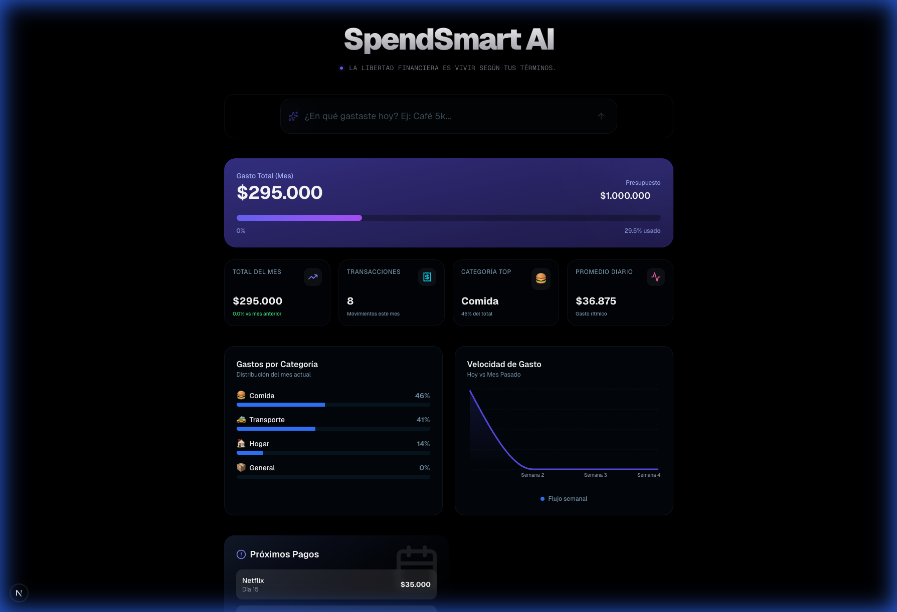
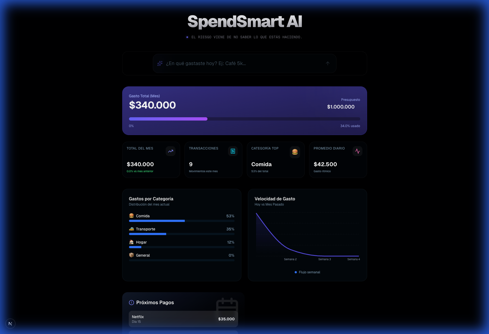

# 💰 SpendSmart AI — Tu Dinero, Inteligente



**SpendSmart AI** es una plataforma de gestión financiera personal diseñada para brindarte claridad absoluta sobre tus gastos mediante el poder de la Inteligencia Artificial. No es solo un rastreador de gastos; es un copiloto financiero que aprende de tus hábitos y te ayuda a tomar decisiones más inteligentes.

---

## ✨ Características Principales

### 🧠 Magic Input (IA Generativa)
Olvida los formularios complicados. Registra tus gastos simplemente escribiendo o dictando frases naturales:
*   *"Almuerzo con el equipo 45k"*
*   *"Suscripción de Netflix 35,000 ayer"*
*   *"Mercado del mes por 250 USD"*
La IA (Llama 3.3 via Groq) extrae automáticamente el **monto**, la **categoría**, la **fecha** y la **moneda**.

### 📊 Dashboard de Análisis Premium
Visualiza tu salud financiera con gráficos dinámicos y KPIs en tiempo real:
*   **KPIs Críticos**: Gasto total, promedio diario, categoría top y conteo de transacciones.
*   **Distribución de Gastos**: Gráfico de barras detallado por categorías.
*   **Velocidad de Gasto**: Gráfico de flujo semanal para detectar picos de consumo.
*   **Próximos Pagos**: Calendario inteligente de facturas y suscripciones pendientes.

### 🤖 "Ask My Money" (Consultas Contextuales)
Interactúa con tus datos financieros mediante lenguaje natural. Pregunta a la IA sobre tus patrones de gasto y obtén respuestas basadas en tu historial real.

---

## 📸 Demostración de Voz/IA


*Ejemplo de procesamiento automático tras ingresar un gasto por el Magic Input.*

---

## 🛠️ Stack Tecnológico

*   **Frontend**: [Next.js 15+](https://nextjs.org/) (App Router), [React 19](https://react.dev/), [Tailwind CSS](https://tailwindcss.com/).
*   **Backend & DB**: [Supabase](https://supabase.com/) (PostgreSQL + Row Level Security).
*   **Inteligencia Artificial**: [Groq Cloud](https://groq.com/) (Llama 3.3 & Llama 3.2 Vision).
*   **Visualización**: [Recharts](https://recharts.org/) & [Framer Motion](https://www.framer.com/motion/).
*   **UI Components**: Radix UI + Lucide React.

---

## 🚀 Instalación y Configuración

1.  **Clonar el repositorio:**
    ```bash
    git clone https://github.com/leonardomorales03/SpendSmartAI.git
    cd SpendSmartAI
    ```

2.  **Instalar dependencias:**
    ```bash
    npm install
    ```

3.  **Configurar variables de entorno:**
    Crea un archivo `.env.local` en la raíz con las siguientes claves:
    ```env
    NEXT_PUBLIC_SUPABASE_URL=tu_url_de_supabase
    NEXT_PUBLIC_SUPABASE_ANON_KEY=tu_clave_anon_de_supabase
    GROQ_API_KEY=tu_api_key_de_groq
    ```

4.  **Ejecutar en desarrollo:**
    ```bash
    npm run dev
    ```
    Visita `http://localhost:3000` para ver la app en acción.


## 📄 Licencia
Este proyecto es privado y se desarrolla con fines de portafolio profesional.
